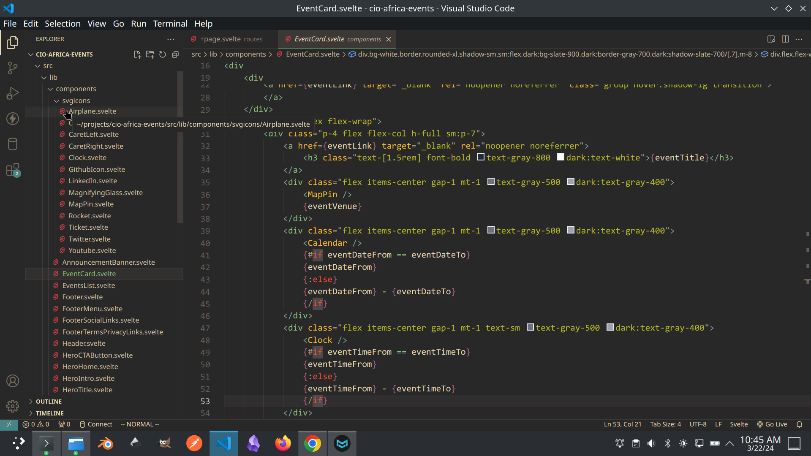

# dx5 Events Web App - Figma to Code Test

## Instructions

1. [Open the file in Figma](https://t.ly/hu_MO)

2. Carefully analyse the design and plan how you are going to break it down into simple, independent, re-usable components.

3. Create a Sveltekit project and code each component, taking care to use understandable component names and prop names. If hired, all the data you need will be served over one or more API endpoints. For now, use "mock" sample data in your route's js file(s), preferrably as Javascript arrays/objects. For images, you can use an API service such as [https://via.placeholder.com/800x533](https://via.placeholder.com/800x533) to generate an 800px by 533px image, for instance. You can also serve them from the "assets" folder or load them from a folder under "lib" via Sveltekit's "$lib" alias.

4. If you're going to use a CSS styles library, use Tailwindcss or a Tailwindcss-based library like [Preline](https://preline.co).

5. See below for an example screenshot of the relevant project structure section to get an idea of what we're looking for. It's a screenshot of part of the on-going project open in Vs Code, - the same project you'll be working on if hired.

## Link to Figma File

https://t.ly/hu_MO

## Link to this test on Github

https://t.ly/QWTKg
